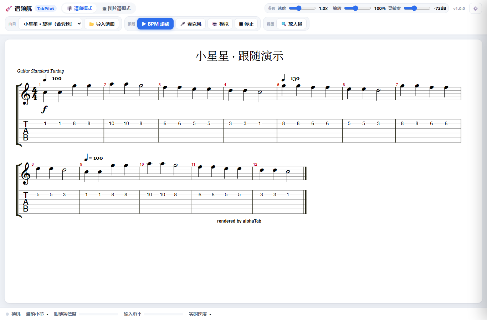
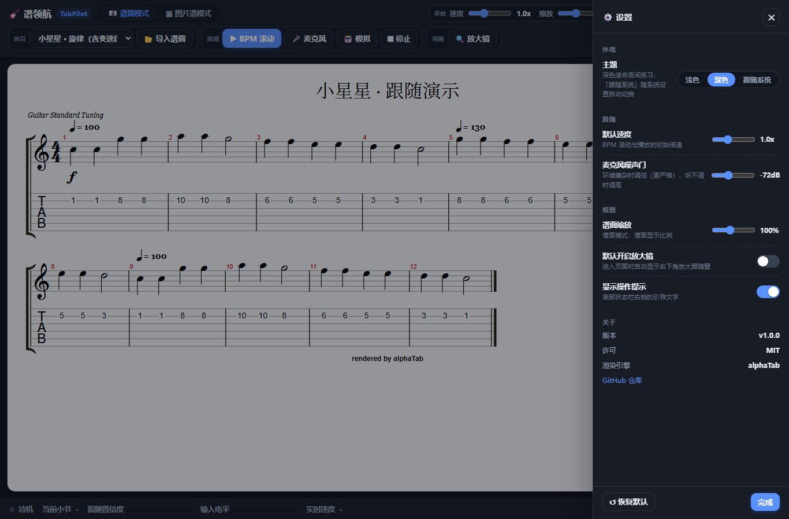
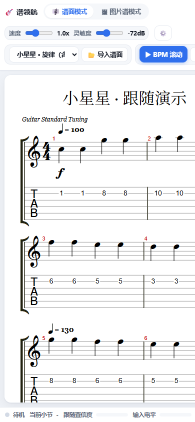

# 谱领航 TabPilot

> 吉他谱自动跟随练习工具 · Guitar tab auto-follow practice tool
> 弹到哪，跟到哪——谱面实时高亮 + 放大镜
> Play along: the score follows your performance with live highlighting + magnifier.

---

## 简介 · Intro

**谱领航 TabPilot** 是一款面向吉他弹唱练习的网页 / 桌面应用。开启麦克风后，它会**实时识别你弹到了第几小节**，自动滚动并把当前位置高亮、放大，让你专注于弹奏而不是找谱。

**TabPilot** is a web / desktop app for guitar practice. Once the microphone is on, it **detects in real time which bar you are playing**, auto-scrolls the score, and highlights + magnifies the current position so you can focus on playing instead of hunting for the right spot.

---

## ✨ 功能特性 · Features

### 模式一：结构化谱（谱面模式）
### Mode 1: Structured Score (`index.html`)

- 导入 **Guitar Pro / MusicXML / alphaTex**，由 alphaTab 渲染五线谱 + 六线谱
  Import **Guitar Pro / MusicXML / alphaTex**, rendered by alphaTab as standard + tablature notation.
- **BPM 自动滚动**：按设定速度匀速跟弹
  **BPM auto-scroll**: steady follow-along at the set tempo.
- **麦克风跟随**：实时识别弹奏进度，弹到哪跟到哪（OTW-lite 谱跟随算法）
  **Mic following**: real-time progress tracking via the OTW-lite score-following algorithm.
- **模拟跟随**：无需麦克风即可演示跟随效果
  **Simulated follow**: demo the following effect without a microphone.
- **放大镜**：当前位置以 SVG 克隆方式放大显示
  **Magnifier**: the current region is shown enlarged via an SVG clone.
- **当前音符红色高亮** / **Current note highlighted in red**.

### 模式二：图片谱（图片谱模式）
### Mode 2: Image Tab (`image-tab.html`)

- 加载谱图（内置示例：Beyond《喜欢你》）
  Load a tab image (demo: Beyond – *喜欢你*).
- **自动识别谱行**（水平投影聚类）+ **小节线检测**
  **Auto-detect staff lines** (horizontal projection clustering) + **bar-line detection**.
- **红色当前小节框** + 行进度扫描线
  **Red current-bar box** + per-line progress scanline.
- **节拍器** / **Metronome**.
- **Canvas 放大镜** / **Canvas magnifier**.
- **移动端侧栏抽屉**：行列表在窄屏下收起
  **Mobile drawer**: the line list collapses on narrow screens.

### 通用 · Common

- **PWA + 移动端适配**：可"添加到主屏幕"，手机浏览器也能用
  **PWA + mobile ready**: add-to-home-screen, works on phone browsers.
- **Tauri 2 桌面壳**：打包为约 5 MB 的 Windows 独立 `.exe`（原 Electron 版为 188 MB）
  **Tauri 2 desktop shell**: packaged as a standalone Windows `.exe` of ~5 MB (vs. 188 MB with Electron).
- **主题切换**：浅色 / 深色 / 跟随系统；深色下谱面仍保持纸白以保证对比度
  **Theme switching**: light / dark / follow system; the score area stays paper-white for contrast.
- **设置面板**：主题、默认速度、麦克风噪声门、谱面缩放、放大镜默认开关，全部持久化
  **Settings panel**: theme, default speed, mic gate, score zoom, magnifier default — all persisted.

---

## 📸 截图 · Screenshots

| 谱面模式 · 浅色 | 谱面模式 · 深色（含设置面板） |
| --- | --- |
|  |  |

| 图片谱模式（移动端） | 谱面模式（移动端） |
| --- | --- |
|  |  |

---

## 🧱 技术栈 · Tech Stack

- **前端**：原生 HTML / CSS / JavaScript（无框架）
  Frontend: vanilla HTML / CSS / JavaScript (no framework).
- **乐谱渲染**：[alphaTab](https://github.com/CoderLine/alphaTab) (MPL-2.0)
  Score rendering: alphaTab (MPL-2.0).
- **音频分析**：Web Audio API（实时 12 维 chroma 提取）
  Audio analysis: Web Audio API (live 12-dim chroma extraction).
- **跟随算法**：OTW-lite 谱跟随（chroma 时号对齐 + 迟滞切换 + 防抖）
  Following: OTW-lite score following (chroma alignment + hysteresis + debounce).
- **PWA**：Service Worker + Web App Manifest
  PWA: Service Worker + Web App Manifest.
- **桌面 / 移动壳**：Tauri 2（Rust + 系统 WebView），一套前端同时产出桌面与移动端
  Desktop / mobile shell: Tauri 2 (Rust + system WebView) — one frontend for desktop and mobile.

---

## 📂 目录结构 · Project Structure

```text
TabPilot/
├── public/                  # 前端 Web 根 / PWA 根（自包含，禁止 ../ 反向引用）
│   ├── index.html           #   谱面模式入口 (Structured score entry)
│   ├── image-tab.html       #   图片谱模式入口 (Image-tab entry)
│   ├── css/                 #   样式三层：令牌 → 布局 → 控件
│   │   ├── base.css         #     设计令牌、主题变量、基础重置
│   │   ├── layout.css       #     应用骨架（顶栏 / 舞台 / 侧栏 / 状态栏）
│   │   └── components.css   #     控件、浮层、设置抽屉
│   ├── js/
│   │   ├── theme.js         #     主题早期注入（防首屏闪烁）
│   │   ├── settings.js      #     设置持久化 + 设置抽屉
│   │   ├── app.js           #     谱面模式业务（渲染 / 跟随 / 放大镜）
│   │   └── image-tab.js     #     图片谱业务（校准 / 时间轴 / 放大镜）
│   ├── manifest.json        #   PWA 清单
│   ├── sw.js                #   PWA Service Worker
│   ├── assets/              #   页面运行时资源（示例谱图）
│   ├── icons/               #   PWA 与页面图标
│   └── vendor/              #   第三方前端依赖（勿改）
│       ├── alphaTab.js
│       ├── sonivox.sf3
│       └── font/Bravura.{otf,woff,woff2}
├── src-tauri/               # Tauri 2 桌面 / 移动壳 (Rust)
│   ├── tauri.conf.json      #   窗口、打包、版本、图标、rc 信息
│   ├── build.rs             #   构建脚本（生成 Windows 版本资源）
│   ├── src/{main,lib}.rs    #   Rust 入口与应用构建
│   ├── capabilities/        #   权限声明（最小化）
│   └── icons/               #   各平台图标（含 iOS / Android）
├── docs/                    # 项目文档
│   ├── ARCHITECTURE.md      #   架构、数据流、跟随算法
│   ├── BUILD.md             #   环境、构建、产物、rc 字段映射
│   └── STYLE.md             #   命名与代码规范
├── assets/                  # README 预览截图（不参与打包）
├── package.json             # Tauri CLI 脚本
├── LICENSE                  # MIT
├── NOTICE                   # 第三方许可声明
└── README.md
```

> PWA 的 `start_url` / `scope` 以 `public/` 为根；本地以 `python -m http.server` 运行后
> 访问 `http://localhost:8080/public/index.html`。
> The PWA root is `public/`; served locally via `http://localhost:8080/public/index.html`.

---

## 🚀 运行方式 · Getting Started

### Web / PWA

```bash
cd TabPilot
python -m http.server 8080
# 浏览器打开:
#   谱面模式   → http://localhost:8080/public/index.html
#   图片谱模式 → http://localhost:8080/public/image-tab.html
```

> ⚠️ 需通过 `http(s)` 访问（alphaTab 要通过网络加载音色库）；麦克风授权要求
> **安全上下文**（localhost 或 https）。直接双击 `file://` 打开将无法使用麦克风与音色。
> Serve over `http(s)`; the microphone requires a **secure context**
> (localhost or https). Opening via `file://` disables mic + soundfont.

### Tauri 桌面（开发 / 生产）

```bash
npm install                        # 安装 Tauri CLI
npm run dev                        # 开发模式（热重载）
npm run build                      # 生产构建
```

环境准备、产物路径、exe 版本资源（rc）字段映射与常见问题见 **[docs/BUILD.md](docs/BUILD.md)**。
Environment setup, artifact paths, exe version-resource mapping and troubleshooting: **docs/BUILD.md**.

---

## 📦 打包桌面版（Windows） · Build Desktop

```bash
npm run build
# 可执行文件 : src-tauri/target/release/TabPilot.exe      （约 5 MB）
# MSI 安装包 : src-tauri/target/release/bundle/msi/TabPilot_1.0.0_x64_en-US.msi（约 3.8 MB）
```

exe 属性（版本信息）由 `src-tauri/tauri.conf.json` 自动生成：

| 属性 | 值 |
| --- | --- |
| 产品名称 / 文件说明 ProductName / FileDescription | TabPilot |
| 公司 CompanyName | abaoa |
| 版权 LegalCopyright | Copyright © 2026 abaoa. Licensed under the MIT License. |
| 文件版本 / 产品版本 FileVersion / ProductVersion | 1.0.0 |

---

## ⚖️ 许可证与第三方声明 · License & Third-party

- 本项目原创代码采用 **MIT 许可证**（见 `LICENSE`）。
  Original code is licensed under the **MIT License** (see `LICENSE`).
- 捆绑的第三方组件（alphaTab / Bravura / Sonivox）保留各自许可证，
  详见 **`NOTICE`**。
  Bundled third-party components keep their own licenses — see **`NOTICE`**.

---

## 🙏 致谢 · Credits

- [alphaTab](https://github.com/CoderLine/alphaTab) — 乐谱渲染与合成
- Steinberg **Bravura** — SMuFL 音乐字形
- **Sonivox** GM 音色库 — 合成器采样

---

## 📌 待办 · TODO

- [x] 重构目录结构（统一到单一自包含 `public/` Web 根）
- [x] 桌面壳迁移到 Tauri 2（体积 188 MB → 约 5 MB）
- [x] 样式体系化（设计令牌 + 三层样式表）
- [x] 主题切换（浅色 / 深色 / 跟随系统）与设置面板
- [x] 补齐项目文档（架构、构建、命名规范）
- [ ] 补充更多示例谱与单元测试
- [ ] 英文界面切换 / i18n
- [ ] macOS / Linux 打包（Tauri 已支持，需在对应平台构建）
- [ ] 移动端打包（Android 需 SDK cmdline-tools + NDK；iOS 需 macOS + Xcode）

---

## 📚 文档 · Docs

- [docs/ARCHITECTURE.md](docs/ARCHITECTURE.md) — 模块划分、数据流、跟随算法
- [docs/BUILD.md](docs/BUILD.md) — 环境、构建、产物、rc 字段、移动端权限
- [docs/STYLE.md](docs/STYLE.md) — 目录职责、命名与代码注释规范
