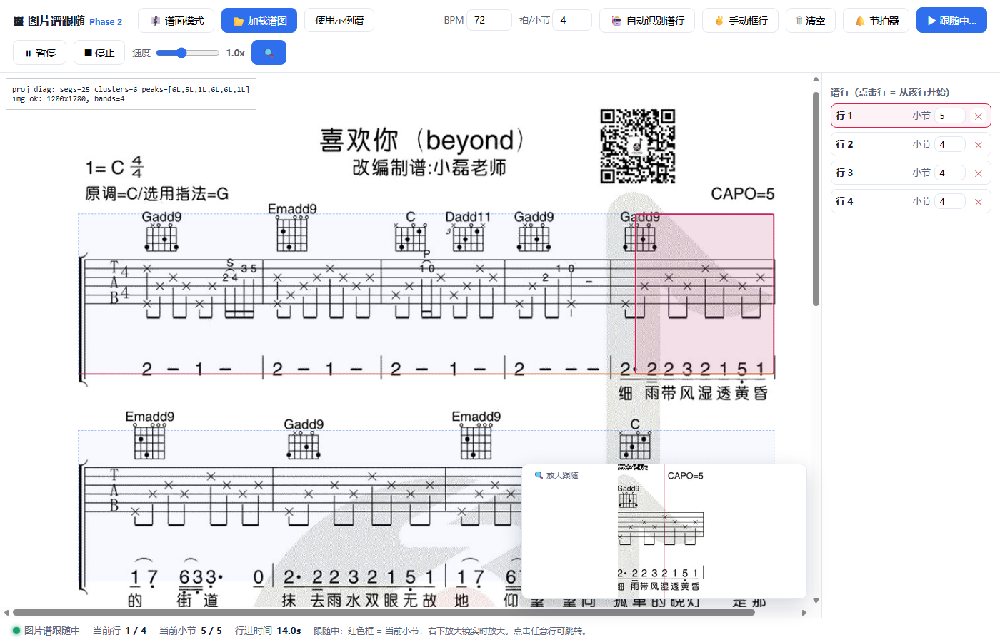
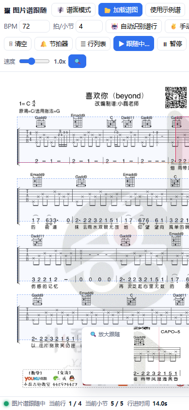

# 谱领航 TabPilot

> 吉他谱自动跟随练习工具 · Guitar tab auto-follow practice tool
> 弹到哪，跟到哪——谱面实时高亮 + 放大镜
> Play along: the score follows your performance with live highlighting + magnifier.

---

## 简介 · Intro

**谱领航 TabPilot** 是一款面向吉他弹唱练习的网页 / 桌面应用。开启麦克风后，它会**实时识别你弹到了第几小节**，自动滚动并把当前位置高亮、放大，让你专注于弹奏而不是找谱。

**TabPilot** is a web / desktop app for guitar practice. Once the microphone is on, it **detects in real time which bar you are playing**, auto-scrolls the score, and highlights + magnifies the current position so you can focus on playing instead of hunting for the right spot.

---

## ✨ 功能特性 · Features

### 模式一：结构化谱（谱面模式）
### Mode 1: Structured Score (`index.html`)

- 导入 **Guitar Pro / MusicXML / alphaTex**，由 alphaTab 渲染五线谱 + 六线谱
  Import **Guitar Pro / MusicXML / alphaTex**, rendered by alphaTab as standard + tablature notation.
- **BPM 自动滚动**：按设定速度匀速跟弹
  **BPM auto-scroll**: steady follow-along at the set tempo.
- **麦克风跟随**：实时识别弹奏进度，弹到哪跟到哪（OTW-lite 谱跟随算法）
  **Mic following**: real-time progress tracking via the OTW-lite score-following algorithm.
- **模拟跟随**：无需麦克风即可演示跟随效果
  **Simulated follow**: demo the following effect without a microphone.
- **放大镜**：当前位置以 SVG 克隆方式放大显示
  **Magnifier**: the current region is shown enlarged via an SVG clone.
- **当前音符红色高亮** / **Current note highlighted in red**.
- **麦克风调试面板**：实时显示音高、电平、置信度
  **Mic debug panel**: live pitch / level / confidence readout.

### 模式二：图片谱（图片谱模式）
### Mode 2: Image Tab (`imageTab.html`)

- 加载谱图（内置示例：Beyond《喜欢你》）
  Load a tab image (demo: Beyond – *喜欢你*).
- **自动识别谱行**（水平投影聚类）+ **小节线检测**
  **Auto-detect staff lines** (horizontal projection clustering) + **bar-line detection**.
- **红色当前小节框** + 行进度扫描线
  **Red current-bar box** + per-line progress scanline.
- **节拍器** / **Metronome**.
- **Canvas 放大镜** / **Canvas magnifier**.
- **移动端侧栏抽屉**：行列表在窄屏下收起
  **Mobile drawer**: the line list collapses on narrow screens.

### 通用 · Common

- **PWA + 移动端适配**：可“添加到主屏幕”，手机浏览器也能用
  **PWA + mobile ready**: add-to-home-screen, works on phone browsers.
- **Electron 桌面壳**：打包为 Windows 独立 `.exe`
  **Electron desktop shell**: packaged as a standalone Windows `.exe`.

---

## 📸 截图 · Screenshots

| 谱面模式（结构化谱） | 移动端 |
| --- | --- |
|  |  |



---

## 🧱 技术栈 · Tech Stack

- **前端**：原生 HTML / CSS / JavaScript（无框架）
  Frontend: vanilla HTML / CSS / JavaScript (no framework).
- **乐谱渲染**：[alphaTab](https://github.com/CoderLine/alphaTab) (MPL-2.0)
  Score rendering: alphaTab (MPL-2.0).
- **音频分析**：Web Audio API（实时 12 维 chroma 提取）
  Audio analysis: Web Audio API (live 12-dim chroma extraction).
- **跟随算法**：OTW-lite 谱跟随（chroma 时号对齐 + 迟滞切换 + 防抖）
  Following: OTW-lite score following (chroma alignment + hysteresis + debounce).
- **PWA**：Service Worker + Web App Manifest
  PWA: Service Worker + Web App Manifest.
- **桌面壳**：Electron + electron-packager，自定义 `app://` 协议绕过 `file://` 限制
  Desktop: Electron + electron-packager, custom `app://` scheme to bypass `file://` limits.

---

## 📂 目录结构 · Project Structure

```text
TabPilot/
├── index.html          # 结构化谱模式入口 (Structured score entry)
├── imageTab.html       # 图片谱模式入口 (Image-tab entry)
├── app.js              # 结构化谱逻辑 (Structured-score logic)
├── imageTab.js         # 图片谱逻辑 (Image-tab logic)
├── main.js             # Electron 桌面主进程 (Electron main process)
├── manifest.json       # PWA 清单 (PWA manifest)
├── sw.js               # PWA Service Worker
├── package.json
├── icon.ico            # 桌面图标 (Desktop icon)
├── icon-512.png        # PWA / 应用图标
├── demo-xihn.jpg       # 示例图片谱 (Demo image tab)
├── preview*.png        # 预览截图 (Preview screenshots)
├── vendor/             # 第三方本地依赖 (Bundled third-party)
│   ├── alphaTab.js
│   ├── sonivox.sf3
│   └── font/Bravura.{otf,woff,woff2}
├── LICENSE             # MIT
├── NOTICE              # 第三方许可声明 (Third-party notices)
├── dist/               # 打包产物（已 gitignore）
└── node_modules/       # 依赖（已 gitignore）
```

> 说明：当前为初期扁平结构，源码、资源、预览图平铺在根目录。后续计划拆分为
> `src/`、`public/`、`assets/` 等目录（见文末“待办”）。
> Note: currently a flat layout. A `src/`, `public/`, `assets/` split is planned.

---

## 🚀 运行方式 · Getting Started

### Web / PWA

```bash
cd TabPilot
python -m http.server 8080
# 浏览器打开:
#   谱面模式  → http://localhost:8080/index.html
#   图片谱模式 → http://localhost:8080/imageTab.html
```

> ⚠️ 需通过 `http(s)` 访问（alphaTab 要通过网络加载音色库）；麦克风授权要求
> **安全上下文**（localhost 或 https）。直接双击 `file://` 打开将无法使用麦克风与音色。
> Serve over `http(s)`; the microphone requires a **secure context**
> (localhost or https). Opening via `file://` disables mic + soundfont.

### Electron 桌面（开发）

```bash
npm install
npm start            # 以开发模式启动桌面应用
```

---

## 📦 打包桌面版（Windows exe） · Build Desktop

```bash
npm run dist         # 产物: dist/TabPilot-win32-x64/TabPilot.exe
```

---

## ⚖️ 许可证与第三方声明 · License & Third-party

- 本项目原创代码采用 **MIT 许可证**（见 `LICENSE`）。
  Original code is licensed under the **MIT License** (see `LICENSE`).
- 捆绑的第三方组件（alphaTab / Bravura / Sonivox）保留各自许可证，
  详见 **`NOTICE`**。
  Bundled third-party components keep their own licenses — see **`NOTICE`**.

---

## 🙏 致谢 · Credits

- [alphaTab](https://github.com/CoderLine/alphaTab) — 乐谱渲染与合成
- Steinberg **Bravura** — SMuFL 音乐字形
- **Sonivox** GM 音色库 — 合成器采样

---

## 📌 待办 · TODO

- [ ] 重构目录结构（`src/` 逻辑、`public/` 前端、`assets/` 资源）
- [ ] 补充更多示例谱与单元测试
- [ ] 英文界面切换 / i18n
- [ ] 跨平台打包（macOS / Linux）
